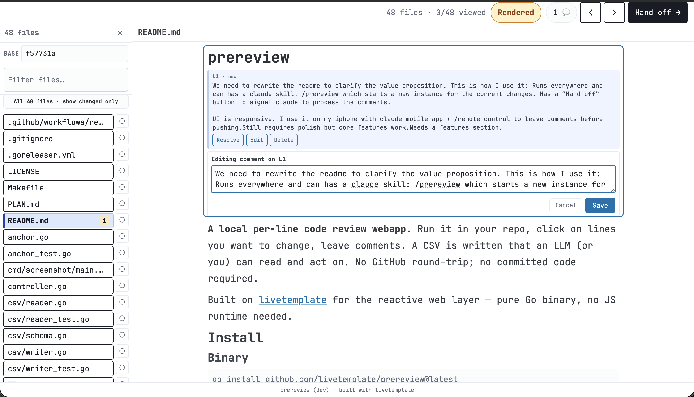
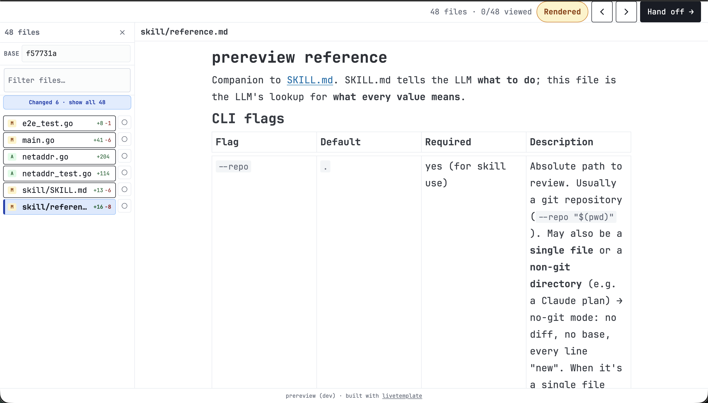
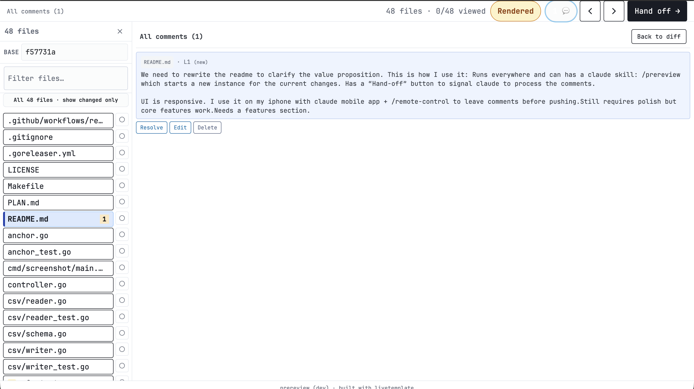
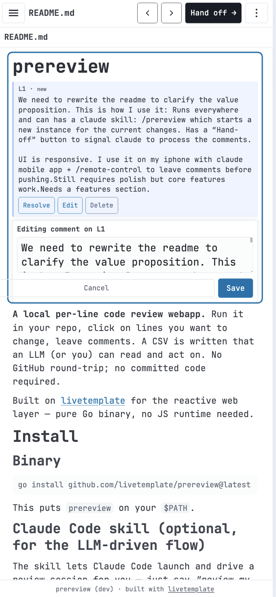
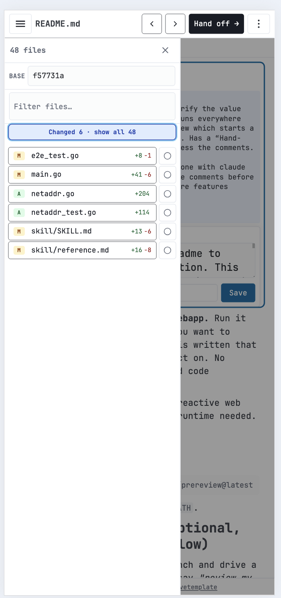

# prereview

**Review your own changes — per line — before you push, and hand the comments to an LLM to act on.**

prereview is a tiny local webapp for per-line review of your *working
tree*. Run it in a repo (or point it at a single file or a non-git
directory), open the URL, tap the lines you want changed, and leave
comments. No commit, no PR, no GitHub round-trip.

**Review a remote box from your phone.** Your code usually lives on a
dev box — a server, a cloud VM, a machine on your tailnet — not the
laptop in front of you. Run prereview *there*: on a remote (SSH) box it
auto-binds that host's Tailscale address (never the public internet),
so the review URL opens straight from the Claude mobile app over the
tailnet. Pair it with `/remote-control` to comment per line and hand
off to Claude from your phone — *before anything is committed or
pushed*. No SSH-from-a-laptop, no desk required.

The point is the **hand-off loop**. prereview ships as a
[Claude Code](https://claude.com/claude-code) skill: say *"review my
changes"* (or `/prereview`) and Claude launches a session scoped to
your current changes and hands you a link. You leave comments, hit
**"Hand off → Claude"**, and Claude reads every comment and applies it.
You never run anything by hand.

Pure Go single binary built on
[livetemplate](https://github.com/livetemplate/livetemplate) — no JS
runtime, no Node.

> **Status:** the core flow — review → hand-off → LLM applies the
> comments — works end-to-end and is in daily use. The UI is still
> being polished; expect rough edges, not missing teeth.

<p align="center">
  
</p>

<p align="center">
  
  &nbsp;
  
</p>

<p align="center">
  
  &nbsp;&nbsp;
  
</p>

<p align="center"><sub>Per-line review &amp; hand-off on desktop · the all-comments view · <b>the same flow from your phone</b></sub></p>

## Features

- **Per-line & range comments on your working tree** — two-click range
  select; comment on any file (changed or not); a single file or a
  non-git directory works too.
- **The hand-off loop** — a **"Hand off → Claude"** button writes a
  marker; the Claude Code skill polls it, reads the CSV, and applies
  your comments. Review → hand-off → changes, without leaving the chat.
- **Ships as a Claude Code skill** — `/prereview` (or *"review my
  changes"*) launches a session scoped to your current changes;
  `prereview --install-skill` installs it from the binary.
- **Responsive, phone-friendly UI** — review from an iPhone via the
  Claude mobile app + `/remote-control`, comment, hand off, push.
- **Tailscale-aware binding** — on a remote (SSH) box it auto-binds
  your tailnet address (reachable from your phone, never the public
  internet); locally it stays on `127.0.0.1`. No `--host` juggling.
- **Markdown renders, but comments by source line** — `.md` shows
  formatted; tapping a rendered block selects its real line range, so
  it round-trips with the raw view and the CSV.
- **Diff or full-file view** — changed hunks with context, or the whole
  file; line numbers match so a comment resolves across both.
- **Durable, boring storage** — one RFC-4180 CSV, atomic writes
  (tmp+fsync+rename). Survives restarts; resume where you left off.
- **Single Go binary** — embeds every asset; no Node/npm, no JS runtime.

## Install

### Binary

```bash
go install github.com/livetemplate/prereview@latest
```

This puts `prereview` on your `$PATH`.

### Claude Code skill (optional, for the LLM-driven flow)

The skill lets Claude Code launch and drive a review session for you —
just say *"review my changes"* or `/prereview` instead of running the
binary by hand.

**Install it with one command** (the binary embeds the skill):

```bash
prereview --install-skill
# → Installed prereview skill → ~/.claude/skills/prereview/SKILL.md
```

That writes `~/.claude/skills/prereview/SKILL.md` (+ `reference.md`),
available in every repo. Re-run after upgrading the binary to refresh
the skill.

<details>
<summary>Manual install (project-scoped, or without the binary)</summary>

From a clone, copy it yourself — e.g. project-scoped so it ships with
the repo for everyone who clones it:

```bash
mkdir -p .claude/skills/prereview
cp skill/SKILL.md .claude/skills/prereview/SKILL.md
```

> **The filename must be exactly `SKILL.md` — uppercase, case-sensitive.**
> A lowercase `skill.md` is silently ignored and the skill never
> registers. `--install-skill` gets this right for you; only a hazard
> if you copy by hand.

</details>

Requirements & notes:

- The skill shells out to the `prereview` binary, so install the binary
  (above) first and keep it on `$PATH`.
- Invoke it with `/prereview`, or natural-language triggers like
  *"review my changes"* / *"per-line code review"*.
- New or renamed skills are normally picked up within the running
  session; if `/prereview` reports "unknown skill", run `/reload` or
  restart Claude Code (discovery is primarily a startup scan).
- `skill/reference.md` is supplementary (full CSV schema + filesystem
  contract). The skill works without it, but copy it alongside
  `SKILL.md` if you want Claude to have the deep reference handy.

## Quick start

### Standalone (manual review)

```bash
cd <your-repo>
prereview
# stdout: READY http://127.0.0.1:43029
```

Open the URL. Browse files in the left drawer, tap a line to select it,
tap another to extend the selection, type a comment, save. Click
**Quit** when done — the server shuts down. Your comments live in
`.prereview/comments.csv`.

### Skill mode (LLM-driven)

With the [Claude Code skill installed](#claude-code-skill-optional-for-the-llm-driven-flow),
just ask Claude to *"review my changes"* (or run `/prereview`). Claude
launches the session, hands you the URL, waits for your hand-off, then
reads and acts on your comments — you don't run anything by hand.

Equivalent manual invocation (what the skill runs for you):

```bash
prereview --skill --repo "$(pwd)" --base HEAD &
```

The UI shows **"Hand off → Claude"** instead of **"Quit"**. When you
click it, `.prereview/DONE` is written with the path to the CSV; the
skill polls for that file, reads the CSV, and acts on the comments.

See [skill/SKILL.md](skill/SKILL.md) for the LLM-side integration and
[skill/reference.md](skill/reference.md) for the full schema +
filesystem reference.

## Flags

| Flag | Default | Meaning |
|---|---|---|
| `--repo` | `.` | Path to the git repo to review |
| `--base` | `HEAD` | Git ref to diff against (any rev-spec: `HEAD~1`, `main`, `origin/master`, commit SHA…) |
| `--port` | `0` | TCP port; 0 = OS-assigned |
| `--host` | auto | Bind address. **Auto:** `127.0.0.1` locally; on a remote (SSH) box, this host's **Tailscale** IP — phone-reachable over the tailnet, never public. Pass an explicit value to override; avoid `0.0.0.0` (binds every interface, including any public IP) |
| `--skill` | `false` | Show "Hand off → Claude" instead of "Quit"; writes `.prereview/DONE` on hand-off |
| `--version` | — | Print build version |

## Usage tips

- **Two-click range selection.** Tap a line to anchor. Tap another to
  extend the selection. Tap again to reseat the anchor. Type and save.
- **Edit/resolve/delete.** Each saved comment has Edit, Resolve,
  Delete buttons in the inline card. Resolve keeps the comment in
  the CSV with `resolved=true` (audit trail); Delete removes it
  entirely (with an Undo toast).
- **All-comments overview.** The `💬 N` chip in the top bar (desktop)
  or the overflow menu (mobile) jumps to a list view of every comment
  across all files; tap a comment to jump back to its source line.
- **Diff vs File.** Toggle "Diff" → "File" (overflow menu on mobile,
  chip on desktop). **Diff** shows only the changed hunks — changed
  lines plus 3 lines of context, with long unchanged runs collapsed to
  a "··· N unchanged lines ···" marker (an unchanged file has no diff,
  so it shows whole). **File** shows the entire current file with no
  diff at all — no add/del coloring, deletions omitted. Line numbers
  are identical in both modes, so a comment made in one resolves in
  the other.
- **Markdown renders by default.** `.md`/`.markdown` files show
  formatted (headings, lists, code, tables) instead of raw lines.
  You can still comment: tap a rendered block (heading, paragraph,
  list, code fence…) and it selects that block's *source* line range —
  the comment anchors to real line numbers, so it round-trips with the
  raw view and the CSV exactly like a line comment. A "Rendered" ⇄
  "Raw" toggle switches to the source line view. Raw HTML embedded in
  the Markdown is not rendered (safe for untrusted repos).
- **Base picker.** The file drawer has a base dropdown listing
  `HEAD~1/3/5/10`, every local branch, and every remote-tracking
  branch (e.g. `origin/main`). For anything more exotic (a specific
  commit SHA, a tag), pass it once at launch with `--base`.
- **File scope.** The drawer defaults to *changed files only* (vs the
  base) — the right default on a large repo. A "Changed N · show all M"
  toggle switches to the full tracked-file list when you want to
  comment on something that didn't change. On a clean tree (nothing
  changed) it auto-shows everything and the toggle is hidden.

## Output

`<repo>/.prereview/comments.csv` is the source of truth — RFC-4180
quoted, 8 columns, one row per comment:

```
id,file,from_line,to_line,side,body,created_at,resolved
```

See [skill/reference.md](skill/reference.md) for the full column
documentation.

## Architecture (at a glance)

- **Single binary**, embeds all assets (including the livetemplate
  client JS bundle) via `//go:embed`.
- **State held server-side** in livetemplate's session storage;
  WebSocket-driven UI patches. Pure Go on the server; no Node/npm.
- **Atomic CSV writes** via tmp+fsync+rename+parent-fsync. Read at any
  time without risk of a torn file.
- **Syntax highlighting** server-side via
  [chroma](https://github.com/alecthomas/chroma) — GitHub light theme.
  Cached per file path; falls back to plain text for unsupported
  languages.

## Development

```bash
git clone https://github.com/livetemplate/prereview
cd prereview
make sync-client   # copies the latest livetemplate-client.js into internal/assets/client/
go build .
./prereview --repo "$(pwd)" --port 8765
```

E2E tests use chromedp + a headless browser:

```bash
go test -tags=browser ./...
```

## License

MIT.
