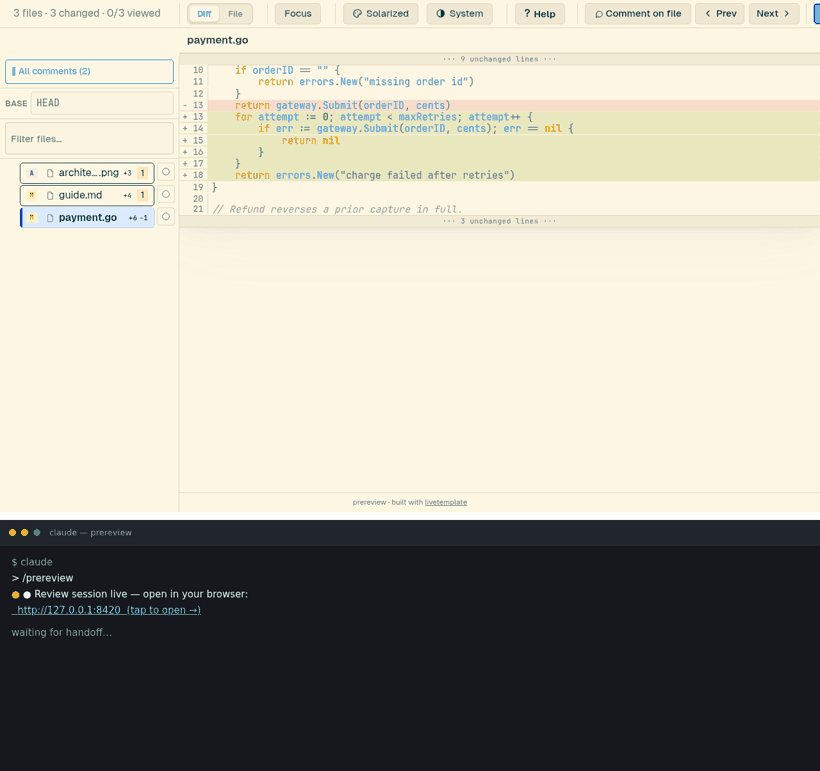
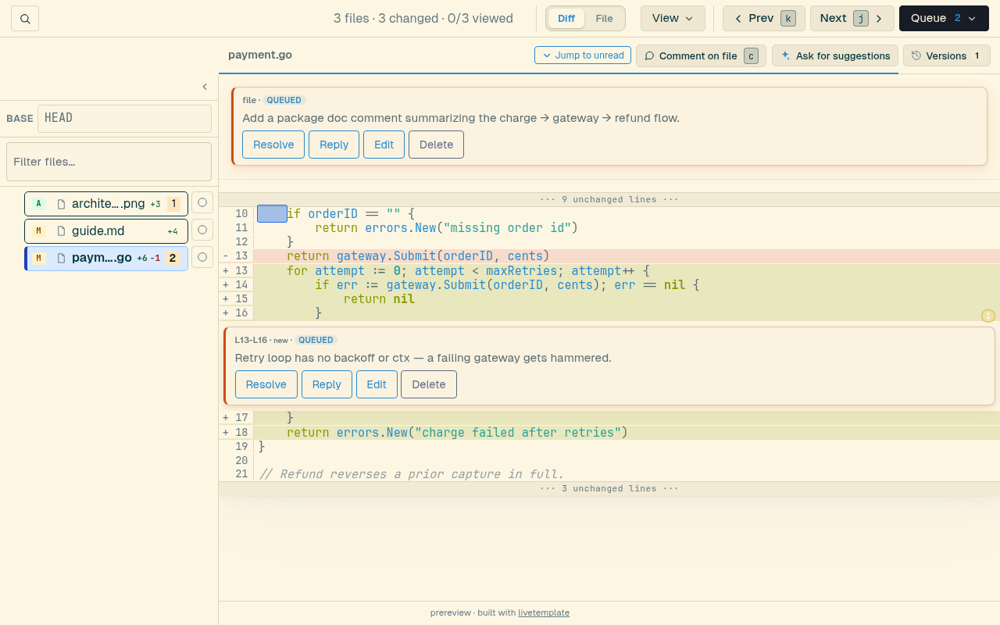
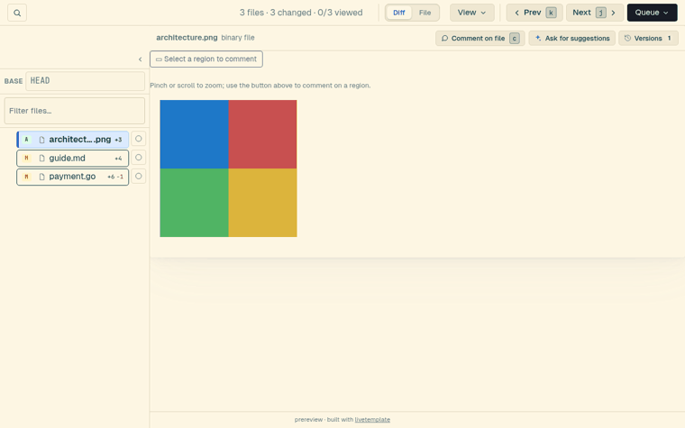
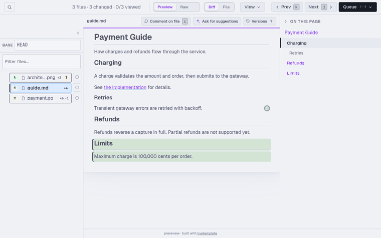
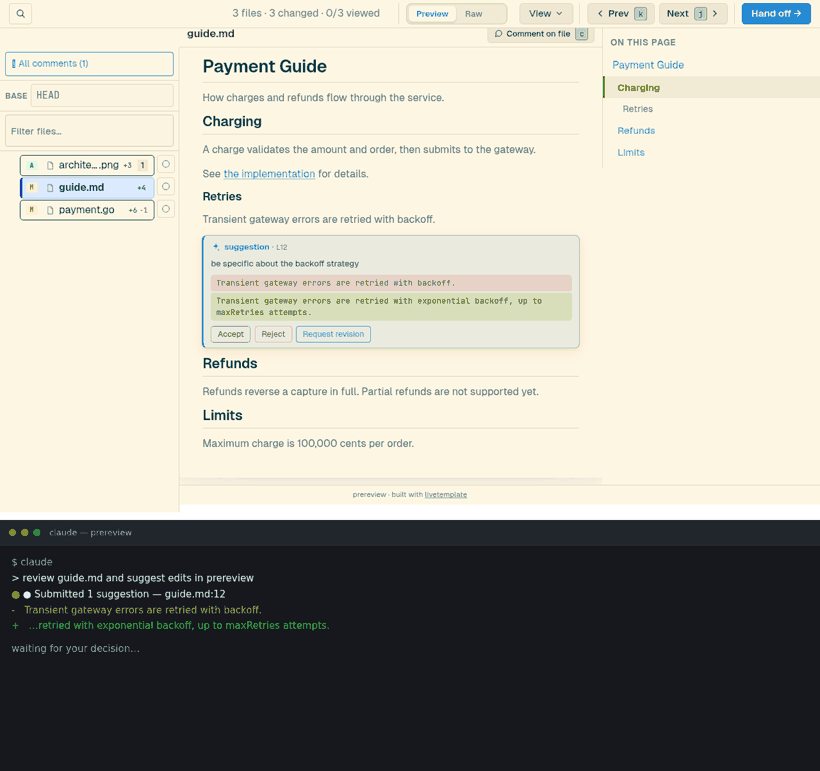
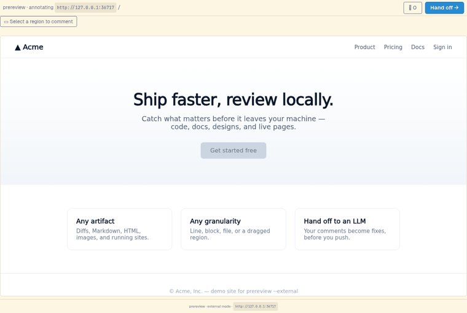
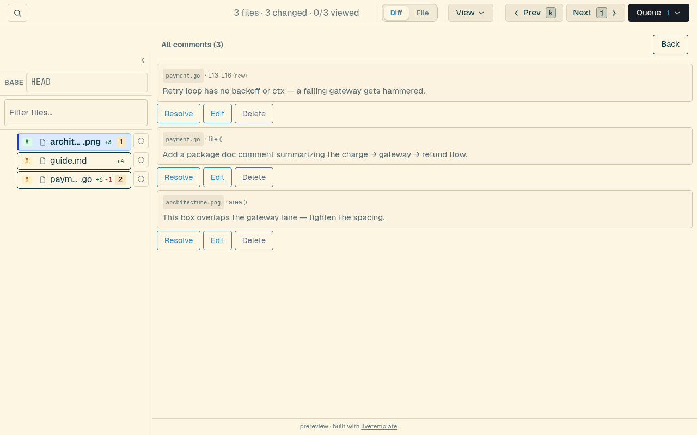
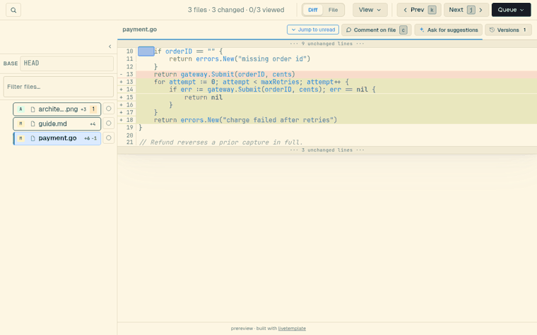
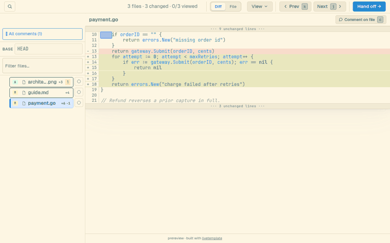
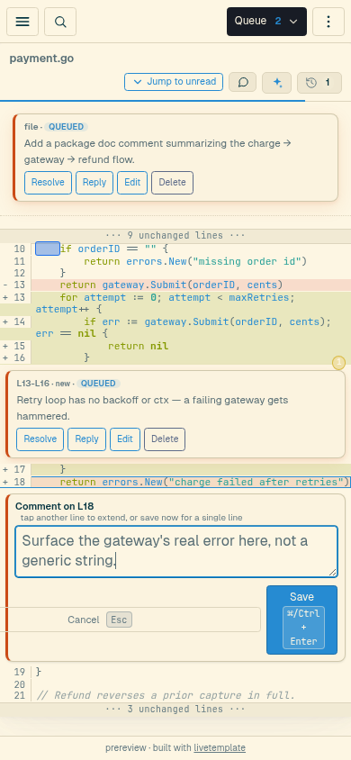

# prereview

prereview speeds up planning and refining what your coding agent produces. Instead of copy-pasting vague pointers into chat, comment right on the artifact — a plan, a diff, a rendered doc, an image, or a live dev site — and the agent applies the fixes. It runs both ways: you can also ask the agent to suggest alternatives and accept or reject them inline, cutting the rounds it takes to get something right. Review from your desk or your phone; works with any LLM CLI, all local.

<p align="center">
  
</p>

<p align="center"><sub><em>Comment on what's wrong — Claude picks it up from the queue and edits the file, the fix lands in the diff, you resolve. Then it proposes an edit you accept. You stay in the loop; the output gets better.</em></sub></p>

Run `prereview` in your repo — or point it at any file or directory — and
it opens a local web UI. Click what you want changed (a line or range in a
diff, a rendered Markdown or HTML block, a region of an image, or a box on
a running dev site) and leave a comment; each is saved to a plain
`.prereview/comments.csv` and streamed to your coding agent, which reads the
comments and makes the changes. It's all local — no commit, no PR, no GitHub
round-trip.

The turnkey [Claude Code](https://claude.com/claude-code) skill runs the
whole loop: `/prereview` starts a session and each comment you leave streams
straight to the agent, which applies the fix and marks it done — **Pause** to
batch a few first, **End session** when you're finished. Any other agent
(OpenAI Codex CLI, Gemini CLI, aider, opencode, cursor-agent) works through
the same open comment protocol — see **[Works with any LLM CLI](#works-with-any-llm-cli)**.
On a remote box prereview binds your Tailscale address, so you can review
from your phone over the tailnet. It also runs the other way: ask the agent
to **suggest edits** (`prereview suggest`) and they appear as inline
before → after boxes you accept or reject — refining an artifact in a few
taps instead of several rounds of copy-paste.

**Get started** — install, then run standalone or drive it from your agent:

```bash
brew install livetemplate/prereview/prereview   # or: curl -fsSL https://raw.githubusercontent.com/livetemplate/prereview/main/install.sh | sh
cd your-repo && prereview                        # standalone: opens the review UI, prints the URL

prereview --install-skill --client=claude        # one-time: install the Claude Code skill
# then just say  /prereview  in Claude Code — it launches a session, you comment, it applies the fixes
```

## Features

- **Review any artifact, at the granularity that fits** — a line or range
  in a diff; a whole file; a rendered **Markdown** or **HTML** block (the
  comment anchors to real source lines); a dragged **region of a binary
  image**; or a box on a **live local site** (`--external`, proxies a
  running dev server). One tool for code and everything around it.
- **The review → fix loop** — run with `--agent` and every comment you save
  streams to a continuous **queue** your agent drains: prereview emits a JSON
  event stream (`ready` / `snapshot` / `end`) the LLM consumes across many
  rounds with `prereview watch` — no re-invocation, no hand-written CSV
  parser. **Pause** to batch comments and release them together, **End
  session** to finish. (The live `watch` loop is the Claude Code default;
  other agents poll `prereview comments --json` per turn — see
  [Works with any LLM CLI](#works-with-any-llm-cli).)
- **Suggested edits, the other direction** — the agent proposes edits
  inline (`prereview suggest`) as before → after boxes; you **accept** or
  **reject** each, and the agent applies the ones you took (`Revert` undoes an
  applied one). prereview never touches your files on its own.
- **See the agent work, and talk back** — each comment shows a live
  **queued → worked-on → done** state and the agent's status pill; **reply**
  on any comment or suggestion for a two-way thread, and every batch the agent
  finishes is snapshotted as a **file version** with its own changelog you can
  view, diff, or restore.
- **Comment on a word or phrase, not just a line** — select any span of
  text (or a rendered Markdown phrase) and the comment anchors to exactly
  those characters. **⌘K / Ctrl-K** searches file names and contents across
  the changed set (or all files) and jumps to a hit.
- **Themes** — Solarized, Gruvbox, and Catppuccin colour schemes ×
  Light / Dark / System, from the toolbar.
- **Full GitHub-flavoured Markdown & HTML render** — tables, task-lists,
  syntax-highlighted code, `> [!NOTE]` alerts, footnotes, `:emoji:` and
  mermaid diagrams render the way GitHub shows them; formatted by default,
  but comments anchor to real source lines and round-trip with the raw view.
- **One CSV, atomically written** — the source of truth; read it any time
  without a torn file.
- **Phone-friendly + Tailscale-aware** — on a remote box it binds your
  tailnet address (never the public internet); review from your phone.
- **Single Go binary** — every asset embedded (Pico, fonts, client JS,
  mermaid); no Node, no JS runtime; works fully offline.

## How it's different

Most "AI code review" tools have the model *find* the problems for you to
read. prereview inverts that: **you** spot what's wrong — across any
artifact, not just code — and the LLM does the *fixing*, locally, before
you push. The loop runs both ways: the agent can also propose edits, and
you're the one who accepts or rejects them.

- **vs. AI reviewers** (CodeRabbit, Gito, Ollama pre-commit hooks, Qodo) —
  they generate the review; prereview captures *your* judgment as
  structured comments an LLM then acts on.
- **vs. team review tools** (Gerrit, ReviewBoard, `arc diff`) — those are
  multi-person, server-side, and code-only; prereview is single-user,
  local, and reviews any artifact.
- **vs. diff viewers** (lazygit, tig, delta, difftastic) — they show
  changes; prereview captures anchored comments and hands them to an LLM.

### Alternatives

Other tools in the "review your agent's changes locally" space — worth a look:

- **[crit.md](https://crit.md/)** — browser-based review of an agent's code
  changes: inline line comments, round-to-round diffs, single local binary,
  any agent (closest to prereview).
- **[diffx](https://github.com/wong2/diffx)** — a local code-review tool built
  for the coding-agent workflow.
- **[tuicr](https://tuicr.dev/)** — a terminal UI (vim keybindings) for reviewing
  a GitHub-style diff; pushes a real PR review or copies structured Markdown for
  your agent.
- **[parley](https://parley.cloudflavor.io/)** — a code-review tool in the same
  space.

## Install

`prereview` is a single static binary. **Prerequisite:** `git` on your
`$PATH`. Pick one:

```bash
# Quick install (macOS / Linux) — downloads the latest release, checksum-verified
curl -fsSL https://raw.githubusercontent.com/livetemplate/prereview/main/install.sh | sh
```
```bash
# Homebrew (macOS / Linux)
brew tap livetemplate/prereview https://github.com/livetemplate/prereview
brew trust --formula livetemplate/prereview/prereview   # one-time: brew requires trusting third-party taps
brew install livetemplate/prereview/prereview
```
```powershell
# Windows (Scoop)
scoop bucket add prereview https://github.com/livetemplate/prereview
scoop install prereview/prereview
```
```bash
# Go toolchain
go install github.com/livetemplate/prereview@latest
```

Quick-install knobs: `PREREVIEW_INSTALL_DIR=/path`, `PREREVIEW_VERSION=vX.Y.Z` (pin a specific release; omit for latest).

<details>
<summary>Behind a corporate proxy, upgrading, or uninstalling</summary>

**Go install with the module proxy blocked**, in order: default (uses
`proxy.golang.org`) → `GOPROXY=direct GOSUMDB=off go install …@latest`
(still needs every dependency's VCS host) → an internal `GOPROXY=…` →
fully air-gapped, use the **Quick install** script or **Homebrew** (a
single prebuilt binary, no module fetching).

**Upgrade:** `brew upgrade prereview` · `scoop update prereview` · re-run
the install script · or `prereview --update` (curl/`go install` binaries
self-update hourly; disable with `--no-update` / `PREREVIEW_NO_UPDATE=1`).

**Uninstall** (your `.prereview/` comments are never touched):
`brew uninstall prereview` · `scoop uninstall prereview` ·
`prereview --uninstall` (defers to brew/scoop if one owns it) ·
`rm "$(go env GOPATH)/bin/prereview"`. Leftovers you can delete by hand:
the skill at `~/.claude/skills/prereview/` and the update-check cache.
</details>

### Install the agent integration (for the LLM-driven flow)

The binary embeds the integration for every supported agent — install with
one command:

```bash
prereview --install-skill                    # pick agent(s) from a menu
prereview --install-skill --client=claude    # Claude Code → ~/.claude/skills/prereview/
prereview --install-skill --client=codex,gemini   # several at once
```

With no `--client`, you get an interactive menu (Claude Code, Codex,
Gemini, opencode, aider, cursor-agent). Then invoke per your agent — for
Claude Code, `/prereview` or *"review my changes"* (if it reports "unknown
skill", run `/reload`). The Claude skill auto-refreshes to match the binary
on the next run after any upgrade — `prereview --update`, `brew upgrade`,
`scoop update`, or `go install` — so you never re-run `--install-skill` to
keep it current. Other agents' files are left as-is (re-run
`--install-skill --client=<id>` to refresh them). Full per-agent details:
**[docs/integrations.md](docs/integrations.md)**.

<details>
<summary>Manual / project-scoped install</summary>

From a clone, copy it yourself (e.g. project-scoped so it ships with the repo):

```bash
mkdir -p .claude/skills/prereview
cp skill/SKILL.md .claude/skills/prereview/SKILL.md
```

> The filename must be exactly `SKILL.md` — uppercase. A lowercase
> `skill.md` is silently ignored. `skill/reference.md` (full CSV schema +
> filesystem contract) is optional but handy to copy alongside.
</details>

## Usage

### Quick start

```bash
cd <your-repo>
prereview                 # standalone: prints READY <url>, shows a Quit button
```

Open the URL, comment, click **Quit**. Comments live in
`.prereview/comments.csv`.

```bash
prereview --agent "$(pwd)" &   # what an agent's skill/command runs for you
```

In agent mode the toolbar shows a **Queue** (⏸ Pause / ▶ Resume) and an
**End session** button: each comment streams to the agent as you save it (Pause
to batch), and the agent picks it up, edits the file, and marks it done. With
Claude Code, just tell it *"review my changes"* and it drives the whole loop;
other agents follow the same protocol — see
[Works with any LLM CLI](#works-with-any-llm-cli),
[docs/integrations.md](docs/integrations.md), and
[skill/SKILL.md](skill/SKILL.md) / [skill/reference.md](skill/reference.md).

### Command line

The review target is the **positional path** (default: current dir);
everything else has a sane default, so a bare `prereview` just works.

```bash
prereview                                # current dir (git repo or not) — just works
prereview ./PLAN.md                      # a single file
prereview ./design-docs                  # a non-git directory — every file shown whole
prereview --base origin/main ../service  # a different git repo vs a ref (flags BEFORE the path)
prereview --external http://localhost:5173 --out ./review   # annotate a live local site (dev server)
prereview --agent                        # agent mode: stream the queue for an LLM (path defaults to .)
prereview --agent --replace              # take over an already-running session for this repo
```

A non-git directory or single file is auto-detected: it's shown whole
(every line commentable), with no diff and no base picker. Flags must come
**before** the path. Full reference — every flag, mode, and combination —
in **[docs/cli.md](docs/cli.md)**.

### What you can review

**Comment on lines.** Tap a line to anchor, tap another to extend the
range (tap again to reseat), then type and save. The gutter line numbers
are permalinks — the URL hash tracks your selection so you can share or
reopen it.

**Comment on a whole file** with the **Comment on file** button — handy
for binary, deleted, or unchanged files where no line is clickable. The
file drawer defaults to *changed files only*; the **show all** toggle
exposes the full tree when you want to comment on something that didn't
change.

<p align="center"></p>

<p align="center"><sub><em>Comment a whole file — changed or not.</em></sub></p>

**Annotate an image region.** On a binary image, drag a rectangle to
select an area and comment on it; the box is stored as fractions, so it
survives re-encoding.

<p align="center"></p>

<p align="center"><sub><em>Drag a box on an image to annotate a region.</em></sub></p>

**Markdown & HTML render** by default; tap a rendered block (heading,
paragraph, list…) to select its *source* lines, so the comment anchors
to real line numbers and round-trips with the raw view. A **Preview ⇄
Raw** toggle switches to source. Long docs get a table-of-contents
sidebar.

<p align="center"></p>

<p align="center"><sub><em>Markdown renders with a TOC; click a block and the comment anchors to its source line.</em></sub></p>

**Take the agent's suggested edits.** Ask for suggestions two ways: in your
LLM chat (*"review this doc and suggest edits in prereview"*), or right in a
**comment** — leave one like *"suggest alternatives for this phrasing"* (the
file header's **Ask for suggestions** menu has ready-made prompts too). Either
way the agent submits them with `prereview suggest` and each renders inline as a
before → after box. **Accept** to take it or **Reject** to drop it — the agent
applies the ones you accept. Want a different take? Reply on the suggestion's
thread and the agent reworks it. Nothing is written to your files until then.

<p align="center"></p>

<p align="center"><sub><em>The agent suggests an edit; you accept or reject it.</em></sub></p>

**Annotate a live local site** (`--external`). Point prereview at a
running dev server; it proxies the page so you can drag a box on any
region and comment — the annotation re-pins to the page as it scrolls.

<p align="center"></p>

<p align="center"><sub><em>Review a running site: drag a region on the live page and comment.</em></sub></p>

**See every comment in one place** — **All comments** (the **View ▾** menu, or
press `a`) lists comments across all files (line, text, file, and area kinds),
each with a jump back to its source.

<p align="center"></p>

<p align="center"><sub><em>Every comment across files in one list.</em></sub></p>

**Search across files.** **⌘K** (Ctrl-K) opens a palette that matches file
names and line contents across the changed set — toggle to search every
file — and jumping to a hit reveals its line, even inside a folded region.

<p align="center"></p>

<p align="center"><sub><em>⌘K searches file names and contents, then jumps to the match.</em></sub></p>

**Pick a theme.** The toolbar cycles three colour schemes — Solarized,
Gruvbox, Catppuccin — each with Light / Dark / System modes; syntax
highlighting recolours with them, no reload.

<p align="center"></p>

<p align="center"><sub><em>Three colour schemes × Light / Dark / System.</em></sub></p>

**Review from your phone.** On a remote box prereview binds your
Tailscale IP, so the same review — comments streaming to the agent and fixes
coming back — works from the Claude mobile app over the tailnet.

<p align="center"></p>

<p align="center"><sub><em>Review and drive the agent from your phone.</em></sub></p>

**More:** **Diff ⇄ File** toggles changed-hunks-with-context vs the whole
file (line numbers match, so comments resolve across both) · the base
**dropdown** picks `HEAD~N`, branches, or remotes (pass anything else via
`--base`) · each comment has **Reply / Edit / Resolve / Delete** (Reply opens a
two-way thread with the agent; Resolve keeps an audit trail; Delete has Undo) ·
a per-line **count badge** shows how many notes sit on a line, and **Hide
annotations** clears the diff · a **read-progress** bar and **Jump to unread**
track how far you've reviewed · the **Versions** panel snapshots each agent
batch with a changelog (view / diff / restore) · everything's keyboard-driven —
press **?** for the full map, **⌘K** to search, `s` to toggle suggestions,
**Esc** to clear a selection.

### Works with any LLM CLI

prereview's hand-off is an **open protocol, not an API** — comments are
written to `.prereview/comments.csv` and streamed as JSON events. Any coding
agent that can read the queue (`prereview comments --json`, or the live
`prereview watch` stream) and edit files can apply your review. Claude Code is
the turnkey path; the others are one command to wire up.

| Agent | Install | Then |
|---|---|---|
| **Claude Code** | `prereview --install-skill --client=claude` | `/prereview` (live `watch` loop, multi-round) |
| **OpenAI Codex CLI** | `prereview --install-skill --client=codex` | `$prereview` / `/skills` |
| **Gemini CLI** | `prereview --install-skill --client=gemini` | `/prereview` |
| **opencode** | `prereview --install-skill --client=opencode` | `/prereview` or `opencode run --command prereview` |
| **aider** | `prereview --install-skill --client=aider` | `~/.config/prereview/aider/prereview-aider.sh <files>` |
| **cursor-agent** | `prereview --install-skill --client=cursor` | `cursor-agent -p --force "use prereview"` |

Run `prereview --install-skill` with **no `--client`** to pick from a menu.
Only Claude Code runs the live blocking `watch` loop; every other agent
**polls `prereview comments --json`** once per turn (you comment, the agent
re-reads the queue and applies the open comments).

> **Maturity** (smoke-tested 2026-06-21, all keyless): **Claude Code**,
> **opencode** (free models), and **aider** (local ollama model) are tested
> end-to-end. **codex** (skill loads from both dirs) and **gemini**
> (`/prereview` discovered in headless) are verified short of the model call.
> **cursor-agent** is install/format-verified (a real run needs `CURSOR_API_KEY`).
> Exact paths, per-agent caveats, and a "bring your own agent" recipe are in
> **[docs/integrations.md](docs/integrations.md)**.

## Output

`<repo>/.prereview/comments.csv` is the source of truth — RFC-4180
quoted, 17 columns, one row per comment:

```
id,file,from_line,to_line,side,body,created_at,resolved,anchor,anchor_status,kind,area,url,from_col,to_col,hidden,enqueued
```

`kind` is `line` (default), `text` (a character range within a line —
`from_col`/`to_col`), `file`, `area`, or `region` (a live-site rectangle
from `--external`, anchored to a `url`); `area` carries the rectangle as
`{x,y,w,h}` fractions. See [skill/reference.md](skill/reference.md) for the
full column docs.

Alongside the CSV, `.prereview/` holds a few sidecar files: the JSON event log
the agent watches (`events.jsonl`); the agent's proposed edits
(`suggestions.jsonl`) and your verdicts on them (`suggestion-decisions.jsonl`);
the comments it marked done (`processed.jsonl`), suggestions it applied /
reverted (`applied.jsonl` / `reverted.jsonl`), and thread replies
(`agent-replies.jsonl` / `reviewer-replies.jsonl`); its live status
(`llm-status.json`); and per-file version checkpoints (`versions/`). See
[docs/cli.md](docs/cli.md#output) for the inventory.

## Architecture (at a glance)

prereview is built entirely on **[livetemplate](https://github.com/livetemplate/livetemplate)**
and is a real-world dogfood of it: the whole interactive UI is server-rendered
Go driving livetemplate's client, with **no custom JavaScript**. When a screen
needs a primitive the framework doesn't have yet, it gets added to livetemplate
rather than worked around here — so prereview doubles as the framework's proving
ground.

- **Single binary**, embeds all assets (incl. the livetemplate client JS)
  via `//go:embed`.
- **State held server-side** in livetemplate's session storage;
  WebSocket-driven UI patches. Pure Go server; no Node/npm.
- **Atomic CSV writes** via tmp+fsync+rename — read at any time without a
  torn file.
- **Server-side syntax highlighting** via
  [chroma](https://github.com/alecthomas/chroma), cached per file path.

## Development

```bash
git clone https://github.com/livetemplate/prereview
cd prereview
make sync-client   # copies the latest livetemplate-client.js into internal/assets/client/
go build .
./prereview
```

E2E tests (in the `e2e/` package) use chromedp + headless chromium: `go test -tags=browser ./e2e/`.
Regenerate the README screenshots with `make screenshots`.

## License

MIT.
